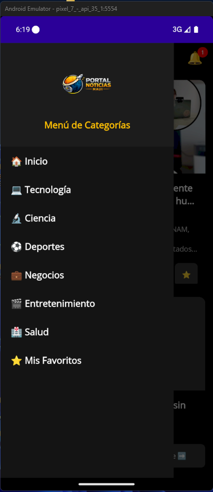
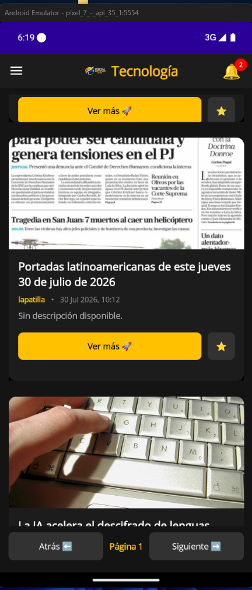
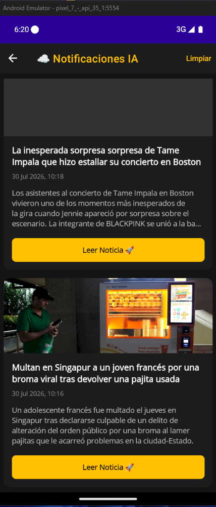

# MANUAL MAESTRO DEFINITIVO: Portal de Noticias TechApp 🚀

Bienvenido a la guía definitiva paso a paso. Este no es un manual cualquiera; es un recorrido pedagógico diseñado para que cualquier persona, sin importar su experiencia previa, pueda entender, construir y dominar la arquitectura de una aplicación móvil profesional.

Aquí no solo vas a copiar y pegar. Aquí vas a **entender** qué hace cada línea, por qué se estructuró de esa manera y cómo se conectan las piezas de este gran rompecabezas.

---

## 📚 SECCIÓN 1: Presentación y Contextualización

| Portada Principal | Detalle de Noticia | Favoritos / Notificaciones |
|:---:|:---:|:---:|
|  |  |  |


### ¿Qué es NoticiasTechApp?
Es una aplicación móvil nativa (construida para Android y Windows) que funciona como un portal de noticias en tiempo real. 
No es una simple lista; es una aplicación robusta que:
1. **Consume datos en vivo** desde internet.
2. **Guarda noticias en memoria local** para lectura offline (Favoritos).
3. **Monitorea en segundo plano** buscando noticias urgentes (ej. Inteligencia Artificial) y te envía notificaciones al celular.
4. **Tiene un navegador interno** para que no tengas que salir de la app para leer un artículo.

### ¿Qué es .NET MAUI y por qué usar la Arquitectura MVVM?
Estamos usando **.NET MAUI**, el framework más moderno de Microsoft para crear apps multiplataforma con un solo código en C#.
Para organizar nuestro código usaremos **MVVM (Model-View-ViewModel)**. 
Imagina un restaurante:
*   **Model (Modelo):** Son los ingredientes (los datos crudos, ej. el título de la noticia).
*   **View (Vista):** Es el plato servido en la mesa (lo que ve el usuario, la interfaz gráfica).
*   **ViewModel (El Cerebro):** Es el Chef. Prepara los ingredientes y los manda a la mesa. 
*¿Por qué no poner todo junto?* Porque si el Chef cocina en la mesa del cliente (arquitectura Code-Behind), todo se vuelve un desorden, la app se congela y es imposible de mantener a futuro. MVVM separa las responsabilidades.

### Herramientas y Librerías (NuGets)
*   `System.Text.Json`: Para leer y escribir archivos físicos (JSON) en el celular de forma ultra rápida.
*   `Plugin.LocalNotification`: Para lanzar notificaciones nativas en el dispositivo.

---

## 🔑 SECCIÓN 2: La API Key (NewsData.io)

Una API (Interfaz de Programación de Aplicaciones) es como un mesero. Tú le pides algo (Noticias de tecnología) y él va a la base de datos de otro servidor (NewsData.io) y te trae la respuesta.
Para que el mesero te atienda, necesitas identificarte. Eso es la **API Key**.

### Paso a paso para obtenerla:
1. Abre tu navegador web y entra a [https://newsdata.io/](https://newsdata.io/).
2. Busca el botón de **Register** (Registrarse) en la parte superior derecha.
3. Puedes crear la cuenta con tu correo o usando Google. Es totalmente gratis.
4. Una vez registrado, entrarás a tu panel principal (Dashboard). 
5. Ahí verás un texto largo alfanumérico etiquetado como **API Key**.
6. **¡IMPORTANTE!** Tu llave debe empezar siempre con `pub_` (ej. `pub_12345ABCD`). Cópiala y guárdala, la pegaremos más adelante en nuestro código.

---

## 🛠️ SECCIÓN 3: Preparación y Arquitectura del Proyecto

### Creando el proyecto
1. Abre **Visual Studio 2022**.
2. Haz clic en **Crear un proyecto nuevo**.
3. En la barra de búsqueda, escribe **MAUI**.
4. Selecciona **Aplicación .NET MAUI** (asegúrate de que el ícono sea de C#). Haz clic en Siguiente.
5. **Nombre del proyecto:** Escribe exactamente `NoticiasTechApp` (sin espacios).
6. **Ubicación:** Tu carpeta de trabajo.
7. **Framework:** Selecciona **.NET 9.0** y dale a Crear.

### Instalando la librería de Notificaciones
1. En el panel lateral derecho (Explorador de Soluciones), haz clic derecho sobre el proyecto `NoticiasTechApp`.
2. Selecciona **Administrar paquetes NuGet...**
3. Ve a la pestaña **Examinar** y busca `Plugin.LocalNotification`.
4. Selecciónalo y dale a **Instalar** (acepta todos los permisos).

### Creando la Estructura de Carpetas
El orden es el éxito. Vamos a crear 3 carpetas clave.
1. Haz clic derecho sobre el proyecto `NoticiasTechApp` -> **Agregar -> Nueva Carpeta**.
2. Repite el proceso para crear estas tres carpetas:
   *   `Models`
   *   `Services`
   *   `ViewModels`

*(Las Vistas visuales las dejaremos sueltas en la carpeta raíz del proyecto para mayor facilidad).*

---

## 💻 SECCIÓN 4: Desarrollo Paso a Paso (El Código)

Llegó la hora de la verdad. Sigue los pasos para crear cada archivo, entiende qué hace, y pega el código correspondiente.

### 📁 FASE 4.1 - MODELS (Los Modelos)

**¿Qué es esto?** Es el "molde". Le decimos a la app qué forma tiene una noticia (Title, Source, Date, etc).

**Paso a Paso:**
1. Haz clic derecho en la carpeta `Models`.
2. Selecciona **Agregar -> Clase...**
3. Nómbrala `NewsModel.cs`.
4. Borra todo lo que traiga y pega este código:

```csharp
using System;

namespace NoticiasTechApp.Models
{
    public class NewsModel
    {
        public string Title { get; set; } = string.Empty;
        public string Source { get; set; } = string.Empty;
        public string Date { get; set; } = string.Empty;
        public string ImageUrl { get; set; } = string.Empty;
        public string Url { get; set; } = string.Empty;
        public string Excerpt { get; set; } = string.Empty;
    }
}
```

---

### 📁 FASE 4.2 - SERVICES (Los Servicios)

Los servicios son los "trabajadores" que buscan o guardan datos. No muestran nada en pantalla.

#### 1. El Buscador de Internet: `NewsService.cs`
**Contexto:** Usa `HttpClient` para conectarse a NewsData.io. Es asíncrono (`async/await`) para no congelar la pantalla.
**Paso a Paso:** Clic derecho en `Services` -> Agregar Clase -> `NewsService.cs`. 
*(Nota: Aquí es donde la app busca la variable de entorno `NEWS_API_KEY`. Si prefieres, puedes reemplazar la llave predeterminada por la tuya).*

```csharp
using System;
using System.Collections.Generic;
using System.Net.Http;
using System.Text.Json;
using System.Threading.Tasks;
using NoticiasTechApp.Models;

namespace NoticiasTechApp.Services
{
    public class NewsService
    {
        private readonly HttpClient _httpClient;
        private readonly string _apiKey;
        public string? NextPageToken { get; private set; }

        public NewsService()
        {
            _httpClient = new HttpClient();
            var envKey = Environment.GetEnvironmentVariable("NEWS_API_KEY");
            var key = string.IsNullOrEmpty(envKey) ? "fca7b9fbbd6e4a4786e3640c3bcfb934" : envKey;
            
            // Garantizar el uso del prefijo pub_
            _apiKey = key.StartsWith("pub_") ? key : "pub_" + key;
        }

        public async Task<List<NewsModel>> GetNewsAsync(string category, string? pageToken = null)
        {
            var list = new List<NewsModel>();
            try
            {
                var cat = category.ToLower();
                var url = $"https://newsdata.io/api/1/news?apikey={_apiKey}&category={cat}&language=es";
                if (!string.IsNullOrEmpty(pageToken))
                {
                    url += $"&page={pageToken}";
                }
                
                var response = await _httpClient.GetAsync(url);
                if (response.IsSuccessStatusCode)
                {
                    var json = await response.Content.ReadAsStringAsync().ConfigureAwait(false);
                    list = await ParseNewsFromJsonAsync(json, true);
                }
            }
            catch (Exception ex)
            {
                Console.WriteLine($"Error obteniendo noticias: {ex.Message}");
            }

            return list;
        }

        public async Task<List<NewsModel>> GetNewsByQueryAsync(string query)
        {
            var list = new List<NewsModel>();
            try
            {
                var q = Uri.EscapeDataString(query);
                var url = $"https://newsdata.io/api/1/news?apikey={_apiKey}&q={q}&language=es";
                
                var response = await _httpClient.GetAsync(url);
                if (response.IsSuccessStatusCode)
                {
                    var json = await response.Content.ReadAsStringAsync().ConfigureAwait(false);
                    list = await ParseNewsFromJsonAsync(json, false);
                }
            }
            catch (Exception ex)
            {
                Console.WriteLine($"Error obteniendo noticias por query: {ex.Message}");
            }
            return list;
        }

        private async Task<List<NewsModel>> ParseNewsFromJsonAsync(string json, bool updateToken)
        {
            var list = new List<NewsModel>();
            await Task.Run(() => 
            {
                using var doc = JsonDocument.Parse(json);
                
                if (updateToken)
                {
                    if (doc.RootElement.TryGetProperty("nextPage", out var np) && np.ValueKind != JsonValueKind.Null)
                    {
                        NextPageToken = np.GetString();
                    }
                    else
                    {
                        NextPageToken = null;
                    }
                }
                
                if (doc.RootElement.TryGetProperty("results", out var resultsElement))
                {
                    var articles = resultsElement.EnumerateArray();
                    foreach (var article in articles)
                    {
                        string title = article.TryGetProperty("title", out var t) && t.ValueKind != JsonValueKind.Null ? t.GetString() ?? "Sin Título" : "Sin Título";
                        string sourceName = article.TryGetProperty("source_id", out var s) && s.ValueKind != JsonValueKind.Null ? s.GetString() ?? "Desconocido" : "Desconocido";
                        string publishedAt = article.TryGetProperty("pubDate", out var p) && p.ValueKind != JsonValueKind.Null ? p.GetString() ?? "" : "";
                        string urlToImage = article.TryGetProperty("image_url", out var img) && img.ValueKind != JsonValueKind.Null ? img.GetString() ?? "" : "";
                        string articleUrl = article.TryGetProperty("link", out var u) && u.ValueKind != JsonValueKind.Null ? u.GetString() ?? "" : "";
                        string description = article.TryGetProperty("description", out var desc) && desc.ValueKind != JsonValueKind.Null ? desc.GetString() ?? "Sin descripción disponible." : "Sin descripción disponible.";

                        if (DateTime.TryParse(publishedAt, out DateTime dateValue))
                        {
                            publishedAt = dateValue.ToString("dd MMM yyyy, HH:mm");
                        }

                        list.Add(new NewsModel
                        {
                            Title = title,
                            Source = sourceName,
                            Date = publishedAt,
                            ImageUrl = string.IsNullOrEmpty(urlToImage) ? "https://via.placeholder.com/600x400.png?text=News" : urlToImage,
                            Url = articleUrl,
                            Excerpt = description
                        });
                    }
                }
            });
            return list;
        }
    }
}
```

#### 2. Persistencia de Favoritos: `FavoritesService.cs`
**Contexto:** Convierte las noticias en texto (JSON) y las guarda en el almacenamiento interno del celular (`FileSystem.AppDataDirectory`). ¡Lectura offline!
**Paso a Paso:** Clic derecho en `Services` -> Agregar Clase -> `FavoritesService.cs`.

```csharp
using System;
using System.Collections.Generic;
using System.IO;
using System.Linq;
using System.Text.Json;
using System.Threading.Tasks;
using Microsoft.Maui.Storage;
using NoticiasTechApp.Models;

namespace NoticiasTechApp.Services
{
    public class FavoritesService
    {
        private readonly string _filePath;

        public FavoritesService()
        {
            _filePath = Path.Combine(FileSystem.AppDataDirectory, "favorites.json");
        }

        public async Task<List<NewsModel>> GetFavoritesAsync()
        {
            if (!File.Exists(_filePath))
                return new List<NewsModel>();

            try
            {
                string json = await File.ReadAllTextAsync(_filePath);
                return JsonSerializer.Deserialize<List<NewsModel>>(json) ?? new List<NewsModel>();
            }
            catch
            {
                return new List<NewsModel>();
            }
        }

        public async Task SaveFavoritesAsync(List<NewsModel> favorites)
        {
            try
            {
                string json = JsonSerializer.Serialize(favorites);
                await File.WriteAllTextAsync(_filePath, json);
            }
            catch (Exception ex)
            {
                Console.WriteLine($"Error saving favorites: {ex.Message}");
            }
        }

        public async Task AddToFavoritesAsync(NewsModel news)
        {
            var favorites = await GetFavoritesAsync();
            if (!favorites.Any(f => f.Url == news.Url)) // Prevent duplicates
            {
                favorites.Add(news);
                await SaveFavoritesAsync(favorites);
            }
        }

        public async Task RemoveFromFavoritesAsync(string url)
        {
            var favorites = await GetFavoritesAsync();
            var item = favorites.FirstOrDefault(f => f.Url == url);
            if (item != null)
            {
                favorites.Remove(item);
                await SaveFavoritesAsync(favorites);
            }
        }

        public async Task<bool> IsFavoriteAsync(string url)
        {
            var favorites = await GetFavoritesAsync();
            return favorites.Any(f => f.Url == url);
        }
    }
}
```

#### 3. Bandeja de Notificaciones: `NotificationsService.cs`
**Contexto:** Similar a favoritos, pero guarda el historial de las noticias urgentes que llegaron mientras no mirabas.
**Paso a Paso:** Clic derecho en `Services` -> Agregar Clase -> `NotificationsService.cs`.

```csharp
using System;
using System.Collections.Generic;
using System.IO;
using System.Linq;
using System.Text.Json;
using System.Threading.Tasks;
using Microsoft.Maui.Storage;
using NoticiasTechApp.Models;

namespace NoticiasTechApp.Services
{
    public class NotificationsService
    {
        private readonly string _filePath;

        public NotificationsService()
        {
            _filePath = Path.Combine(FileSystem.AppDataDirectory, "notifications.json");
        }

        public async Task<List<NewsModel>> GetNotificationsAsync()
        {
            if (!File.Exists(_filePath))
                return new List<NewsModel>();

            try
            {
                string json = await File.ReadAllTextAsync(_filePath);
                return JsonSerializer.Deserialize<List<NewsModel>>(json) ?? new List<NewsModel>();
            }
            catch
            {
                return new List<NewsModel>();
            }
        }

        public async Task SaveNotificationsAsync(List<NewsModel> notifications)
        {
            try
            {
                string json = JsonSerializer.Serialize(notifications);
                await File.WriteAllTextAsync(_filePath, json);
            }
            catch (Exception ex)
            {
                Console.WriteLine($"Error saving notifications: {ex.Message}");
            }
        }

        public async Task AddNotificationAsync(NewsModel news)
        {
            var notifications = await GetNotificationsAsync();
            if (!notifications.Any(n => n.Url == news.Url)) // Evitar duplicados
            {
                notifications.Insert(0, news); // Agregar al principio
                await SaveNotificationsAsync(notifications);
            }
        }
        
        public async Task ClearNotificationsAsync()
        {
            if (File.Exists(_filePath))
            {
                File.Delete(_filePath);
            }
            await Task.CompletedTask;
        }
        
        public async Task<int> GetUnreadCountAsync()
        {
            var notifications = await GetNotificationsAsync();
            return notifications.Count;
        }
    }
}
```

#### 4. El Vigía Silencioso: `NewsMonitorService.cs`
**Contexto:** Un bucle infinito que corre en segundo plano (`Task.Run`). Cada cierto tiempo revisa si hay noticias con las palabras "gemini", "ai" o "cine". Si encuentra una, lanza una campana y una notificación al sistema operativo usando la librería `Plugin.LocalNotification`.
**Paso a Paso:** Clic derecho en `Services` -> Agregar Clase -> `NewsMonitorService.cs`.

```csharp
using System;
using System.Linq;
using System.Threading.Tasks;
using Microsoft.Maui.Storage;
using Plugin.LocalNotification;

namespace NoticiasTechApp.Services
{
    public class NewsMonitorService
    {
        private readonly NewsService _newsService;
        private bool _isRunning;

        public NewsMonitorService(NewsService newsService)
        {
            _newsService = newsService;
        }

        public void StartMonitoring()
        {
            if (_isRunning) return;
            _isRunning = true;

            // Start background timer
            Task.Run(async () =>
            {
                while (_isRunning)
                {
                    try
                    {
                        await CheckForNewImportantNewsAsync();
                    }
                    catch (Exception ex)
                    {
                        Console.WriteLine($"Error en NewsMonitorService: {ex.Message}");
                    }
                    
                    // Esperar 15 minutos antes de verificar de nuevo (o 1 min para pruebas)
                    await Task.Delay(TimeSpan.FromMinutes(2));
                }
            });
        }

        public void StopMonitoring()
        {
            _isRunning = false;
        }

        private async Task CheckForNewImportantNewsAsync()
        {
            // Filtros requeridos: inteligencia artificial (gemini, chatgpt, claude) y cine/estrenos
            string query = "gemini OR chatgpt OR claude OR ai OR cine OR pelicula OR estreno";
            
            var list = await _newsService.GetNewsByQueryAsync(query);
            
            if (list != null && list.Count > 0)
            {
                var latestArticle = list.First();
                
                string lastNotifiedUrl = Preferences.Get("LastNotifiedArticleUrl", string.Empty);
                
                if (latestArticle.Url != lastNotifiedUrl && !string.IsNullOrEmpty(latestArticle.Url))
                {
                    Preferences.Set("LastNotifiedArticleUrl", latestArticle.Url);
                    
                    // Guardar en el historial de Notificaciones (In-App)
                    var notifService = new NotificationsService();
                    await notifService.AddNotificationAsync(latestArticle);
                    
                    // Notificar a la UI (MainPage) para que actualice la campanita/nubecita
                    MessagingCenter.Send<object>(this, "NewNotification");

                    // Asegurar que Plugin.LocalNotification esté inicializado
                    var request = new NotificationRequest
                    {
                        NotificationId = new Random().Next(1000, 9999),
                        Title = "¡Noticia de IA/Cine! 🎬🤖",
                        Description = latestArticle.Title,
                        Schedule = new NotificationRequestSchedule
                        {
                            NotifyTime = DateTime.Now.AddSeconds(3)
                        }
                    };
                    
                    await LocalNotificationCenter.Current.Show(request);
                }
            }
        }
    }
}
```

---

### 📁 FASE 4.3 - VIEWMODELS (Los Cerebros)

Aquí ocurre la magia de `INotifyPropertyChanged`. Cuando una variable cambia aquí, la pantalla se entera sola.

#### 1. Cerebro Principal: `NewsViewModel.cs`
**Contexto:** Controla en qué página de noticias estamos (paginación con Tokens) y la categoría actual.
**Paso a Paso:** Clic derecho en `ViewModels` -> Agregar Clase -> `NewsViewModel.cs`.

```csharp
using System;
using System.Collections.Generic;
using System.Collections.ObjectModel;
using System.ComponentModel;
using System.Runtime.CompilerServices;
using System.Threading.Tasks;
using System.Windows.Input;
using Microsoft.Maui.ApplicationModel;
using Microsoft.Maui.Controls;
using NoticiasTechApp.Models;
using NoticiasTechApp.Services;

namespace NoticiasTechApp.ViewModels
{
    public class NewsViewModel : INotifyPropertyChanged
    {
        private readonly NewsService _newsService;
        private readonly FavoritesService _favoritesService;
        private string _selectedCategory = string.Empty;
        private int _currentPage = 1;
        private bool _isBusy;
        private List<string?> _pageTokens = new List<string?> { null };
        
        public ObservableCollection<NewsModel> NewsList { get; set; } = new ObservableCollection<NewsModel>();
        public ObservableCollection<string> Categories { get; set; } = new ObservableCollection<string>
        {
            "Technology", "Science", "Sports", "Business", "Entertainment", "Health"
        };

        public string SelectedCategory
        {
            get => _selectedCategory;
            set
            {
                if (_selectedCategory != value)
                {
                    _selectedCategory = value;
                    OnPropertyChanged();
                    OnPropertyChanged(nameof(CategoryTitle));
                    CurrentPage = 1;
                    _pageTokens = new List<string?> { null };
                    _ = LoadNewsAsync();
                }
            }
        }

        public string CategoryTitle
        {
            get
            {
                return _selectedCategory switch
                {
                    "Technology" => "Tecnología",
                    "Science" => "Ciencia",
                    "Sports" => "Deportes",
                    "Business" => "Negocios",
                    "Entertainment" => "Entretenimiento",
                    "Health" => "Salud",
                    _ => "Noticias"
                };
            }
        }

        public int CurrentPage
        {
            get => _currentPage;
            set 
            { 
                _currentPage = value; 
                OnPropertyChanged(); 
                OnPropertyChanged(nameof(CanGoBack)); 
            }
        }

        public bool CanGoBack => CurrentPage > 1;

        public bool IsBusy
        {
            get => _isBusy;
            set 
            { 
                _isBusy = value; 
                OnPropertyChanged(); 
                OnPropertyChanged(nameof(IsNotBusy));
            }
        }
        
        public bool IsNotBusy => !IsBusy;
        
        // Notifications Badge properties
        private int _unreadCount;
        public int UnreadCount
        {
            get => _unreadCount;
            set { _unreadCount = value; OnPropertyChanged(); OnPropertyChanged(nameof(HasUnread)); }
        }
        public bool HasUnread => UnreadCount > 0;

        public ICommand LoadMoreCommand { get; }
        public ICommand LoadPreviousCommand { get; }
        public ICommand OpenNewsCommand { get; }
        public ICommand ToggleFavoriteCommand { get; }
        public ICommand SelectCategoryCommand { get; }
        public ICommand OpenNotificationsCommand { get; }

        public NewsViewModel()
        {
            _newsService = new NewsService();
            _favoritesService = new FavoritesService();
            LoadMoreCommand = new Command(async () => await LoadNextPage());
            LoadPreviousCommand = new Command(async () => await LoadPrevPage());
            OpenNewsCommand = new Command<NewsModel>(async (news) => await OpenNewsUrl(news));
            ToggleFavoriteCommand = new Command<NewsModel>(async (news) => await ToggleFavorite(news));
            SelectCategoryCommand = new Command<string>((cat) => SelectedCategory = cat);
            OpenNotificationsCommand = new Command(async () => await OpenNotifications());

            SelectedCategory = Categories[0]; // Technology
            
            // Suscribirse a nuevas notificaciones y limpieza
            MessagingCenter.Subscribe<object>(this, "NewNotification", async (sender) => await LoadUnreadCount());
            MessagingCenter.Subscribe<object>(this, "NotificationsCleared", async (sender) => await LoadUnreadCount());
            
            _ = LoadUnreadCount();
        }
        
        private async Task LoadUnreadCount()
        {
            var ns = new NotificationsService();
            UnreadCount = await ns.GetUnreadCountAsync();
        }
        
        private async Task OpenNotifications()
        {
            if (Shell.Current != null)
                await Shell.Current.Navigation.PushAsync(new NotificationsPage());
        }

        private async Task LoadNextPage()
        {
            if (!string.IsNullOrEmpty(_newsService.NextPageToken))
            {
                if (_pageTokens.Count <= CurrentPage)
                {
                    _pageTokens.Add(_newsService.NextPageToken);
                }
                CurrentPage++;
                await LoadNewsAsync();
            }
        }

        private async Task LoadPrevPage()
        {
            if (CurrentPage > 1)
            {
                CurrentPage--;
                await LoadNewsAsync();
            }
        }

        private async Task LoadNewsAsync()
        {
            if (IsBusy) return;

            IsBusy = true;
            try
            {
                string? token = _pageTokens[CurrentPage - 1];
                var news = await _newsService.GetNewsAsync(SelectedCategory, token);
                NewsList.Clear();
                foreach (var item in news)
                {
                    NewsList.Add(item);
                }
            }
            catch(Exception ex)
            {
                Console.WriteLine(ex.Message);
            }
            finally
            {
                IsBusy = false;
            }
        }

        private async Task OpenNewsUrl(NewsModel news)
        {
            if (news != null && !string.IsNullOrEmpty(news.Url))
            {
                try
                {
                    // Abrir en WebView Interno
                    await Shell.Current.Navigation.PushAsync(new NewsDetailPage(news.Url));
                }
                catch (Exception ex)
                {
                    Console.WriteLine(ex.Message);
                }
            }
        }

        private async Task ToggleFavorite(NewsModel news)
        {
            if (news != null)
            {
                bool isFav = await _favoritesService.IsFavoriteAsync(news.Url);
                if (isFav)
                {
                    await _favoritesService.RemoveFromFavoritesAsync(news.Url);
                    if (Shell.Current != null)
                        await Shell.Current.DisplayAlert("Favoritos", "Noticia eliminada de favoritos", "OK");
                }
                else
                {
                    await _favoritesService.AddToFavoritesAsync(news);
                    if (Shell.Current != null)
                        await Shell.Current.DisplayAlert("Favoritos", "Noticia guardada en favoritos", "OK");
                }
            }
        }

        public event PropertyChangedEventHandler? PropertyChanged;
        protected virtual void OnPropertyChanged([CallerMemberName] string? propertyName = null)
        {
            PropertyChanged?.Invoke(this, new PropertyChangedEventArgs(propertyName));
        }
    }
}
```

#### 2. Cerebro de Favoritos: `FavoritesViewModel.cs`
**Contexto:** Carga las noticias desde el disco duro del celular y las prepara para mostrarse. Permite eliminar favoritos.
**Paso a Paso:** Clic derecho en `ViewModels` -> Agregar Clase -> `FavoritesViewModel.cs`.

```csharp
using System.Collections.ObjectModel;
using System.ComponentModel;
using System.Runtime.CompilerServices;
using System.Threading.Tasks;
using System.Windows.Input;
using Microsoft.Maui.Controls;
using NoticiasTechApp.Models;
using NoticiasTechApp.Services;

namespace NoticiasTechApp.ViewModels
{
    public class FavoritesViewModel : INotifyPropertyChanged
    {
        private readonly FavoritesService _favoritesService;
        private bool _isEmpty;

        public ObservableCollection<NewsModel> FavoriteNews { get; set; } = new ObservableCollection<NewsModel>();

        public bool IsEmpty
        {
            get => _isEmpty;
            set
            {
                _isEmpty = value;
                OnPropertyChanged();
                OnPropertyChanged(nameof(IsNotEmpty));
            }
        }

        public bool IsNotEmpty => !IsEmpty;

        public ICommand RemoveFavoriteCommand { get; }
        public ICommand OpenNewsCommand { get; }

        public FavoritesViewModel()
        {
            _favoritesService = new FavoritesService();
            RemoveFavoriteCommand = new Command<NewsModel>(async (news) => await RemoveFavorite(news));
            OpenNewsCommand = new Command<NewsModel>(async (news) => await OpenNewsUrl(news));
        }

        public async Task LoadFavoritesAsync()
        {
            var favs = await _favoritesService.GetFavoritesAsync();
            FavoriteNews.Clear();
            foreach (var f in favs)
            {
                FavoriteNews.Add(f);
            }
            IsEmpty = FavoriteNews.Count == 0;
        }

        private async Task RemoveFavorite(NewsModel news)
        {
            if (news != null)
            {
                await _favoritesService.RemoveFromFavoritesAsync(news.Url);
                FavoriteNews.Remove(news);
                IsEmpty = FavoriteNews.Count == 0;
                if (Shell.Current != null)
                    await Shell.Current.DisplayAlert("Favoritos", "Noticia eliminada de favoritos", "OK");
            }
        }

        private async Task OpenNewsUrl(NewsModel news)
        {
            if (news != null && !string.IsNullOrEmpty(news.Url))
            {
                await Shell.Current.Navigation.PushAsync(new NewsDetailPage(news.Url));
            }
        }

        public event PropertyChangedEventHandler? PropertyChanged;
        protected virtual void OnPropertyChanged([CallerMemberName] string? propertyName = null)
        {
            PropertyChanged?.Invoke(this, new PropertyChangedEventArgs(propertyName));
        }
    }
}
```

#### 3. Cerebro de Notificaciones: `NotificationsViewModel.cs`
**Contexto:** Maneja la lista de notificaciones pendientes y el contador de notificaciones no leídas.
**Paso a Paso:** Clic derecho en `ViewModels` -> Agregar Clase -> `NotificationsViewModel.cs`.

```csharp
using System.Collections.ObjectModel;
using System.Threading.Tasks;
using System.Windows.Input;
using Microsoft.Maui.Controls;
using NoticiasTechApp.Models;
using NoticiasTechApp.Services;

namespace NoticiasTechApp.ViewModels
{
    public class NotificationsViewModel : BindableObject
    {
        private readonly NotificationsService _notificationsService;
        private bool _isBusy;

        public ObservableCollection<NewsModel> NotificationList { get; set; } = new ObservableCollection<NewsModel>();

        public bool IsBusy
        {
            get => _isBusy;
            set { _isBusy = value; OnPropertyChanged(); }
        }

        public bool HasNoNotifications => NotificationList.Count == 0;

        public ICommand LoadNotificationsCommand { get; }
        public ICommand OpenNewsCommand { get; }
        public ICommand ClearNotificationsCommand { get; }

        public NotificationsViewModel()
        {
            _notificationsService = new NotificationsService();
            LoadNotificationsCommand = new Command(async () => await LoadNotifications());
            OpenNewsCommand = new Command<NewsModel>(async (news) => await OpenNews(news));
            ClearNotificationsCommand = new Command(async () => await ClearNotifications());
        }

        public async Task LoadNotifications()
        {
            IsBusy = true;
            var list = await _notificationsService.GetNotificationsAsync();
            NotificationList.Clear();
            foreach (var item in list)
            {
                NotificationList.Add(item);
            }
            OnPropertyChanged(nameof(HasNoNotifications));
            
            // Inform UI to update badge count to 0 since we viewed them
            MessagingCenter.Send<object>(this, "NotificationsCleared");
            
            IsBusy = false;
        }

        private async Task OpenNews(NewsModel news)
        {
            if (news != null && !string.IsNullOrEmpty(news.Url))
            {
                await Shell.Current.Navigation.PushAsync(new NewsDetailPage(news.Url));
            }
        }
        
        private async Task ClearNotifications()
        {
            await _notificationsService.ClearNotificationsAsync();
            NotificationList.Clear();
            OnPropertyChanged(nameof(HasNoNotifications));
            MessagingCenter.Send<object>(this, "NotificationsCleared");
        }
    }
}
```

---

### 📁 FASE 4.4 - LAS VISTAS (Interfaz Gráfica)

Estos archivos van en la **raíz** del proyecto. Por cada vista, tenemos el diseño (`.xaml`) y su Code-Behind (`.xaml.cs`). 
*Regla de MVVM: El Code-Behind debe estar lo más vacío posible.*

#### 1. La Pantalla de Arranque Animada: `SplashPage`
**Contexto:** Le da un aspecto premium a la app haciendo una animación de escalado al abrirse, eliminando la aburrida pantalla negra por defecto.
**Paso a Paso:** Clic derecho al proyecto -> Agregar -> Nuevo Elemento -> **.NET MAUI ContentPage (XAML)** -> `SplashPage.xaml`.

**Código para `SplashPage.xaml`:**
```xml
<?xml version="1.0" encoding="utf-8" ?>
<ContentPage xmlns="http://schemas.microsoft.com/dotnet/2021/maui"
             xmlns:x="http://schemas.microsoft.com/winfx/2009/xaml"
             x:Class="NoticiasTechApp.SplashPage"
             BackgroundColor="#121212"
             Shell.NavBarIsVisible="False">
    <Grid>
        <!-- Logo inicial MUCHO más grande -->
        <Image x:Name="SplashLogo" 
               Source="noticias_maui.png" 
               HeightRequest="250" 
               WidthRequest="250" 
               Scale="0"
               HorizontalOptions="Center" 
               VerticalOptions="Center" />
    </Grid>
</ContentPage>
```

**Código para `SplashPage.xaml.cs` (Code-Behind):**
```csharp
using System;
using System.Threading.Tasks;
using Microsoft.Maui.Controls;

namespace NoticiasTechApp
{
    public partial class SplashPage : ContentPage
    {
        public SplashPage()
        {
            InitializeComponent();
        }

        protected override async void OnAppearing()
        {
            base.OnAppearing();
            
            // Animación suave creciendo
            await SplashLogo.ScaleTo(1.5, 2000, Easing.CubicOut);
            await SplashLogo.FadeTo(0, 500);

            // Cambiar a la ventana principal de forma segura en MAUI
            if (Application.Current != null && Application.Current.Windows.Count > 0)
            {
                Application.Current.Windows[0].Page = new AppShell();
            }
        }
    }
}
```

#### 2. El Menú Lateral: `AppShell`
**Contexto:** Es el contenedor de toda la app. Define el menú deslizable (hamburguesa) y los colores globales oscuros.
**Paso a Paso:** Este archivo ya existe. Ábrelo y reemplaza su contenido.

**Código para `AppShell.xaml`:**
```xml
<?xml version="1.0" encoding="UTF-8" ?>
<Shell
    x:Class="NoticiasTechApp.AppShell"
    xmlns="http://schemas.microsoft.com/dotnet/2021/maui"
    xmlns:x="http://schemas.microsoft.com/winfx/2009/xaml"
    xmlns:local="clr-namespace:NoticiasTechApp"
    FlyoutBehavior="Flyout"
    FlyoutBackgroundColor="#121212"
    Shell.BackgroundColor="#1E1E1E"
    Shell.TitleColor="#FFC107"
    Shell.ForegroundColor="#FFFFFF"
    Shell.UnselectedColor="#AAAAAA">

    <Shell.ItemTemplate>
        <DataTemplate>
            <Grid Padding="20,15">
                <Label Text="{Binding Title}" TextColor="#FFFFFF" FontSize="18" FontAttributes="Bold" VerticalOptions="Center"/>
            </Grid>
        </DataTemplate>
    </Shell.ItemTemplate>

    <Shell.MenuItemTemplate>
        <DataTemplate>
            <Grid Padding="20,15">
                <Label Text="{Binding Text}" TextColor="#FFFFFF" FontSize="18" FontAttributes="Bold" VerticalOptions="Center"/>
            </Grid>
        </DataTemplate>
    </Shell.MenuItemTemplate>

    <Shell.FlyoutHeader>
        <Grid HeightRequest="200" BackgroundColor="#1E1E1E" Padding="20">
            <StackLayout VerticalOptions="Center" HorizontalOptions="Center" Spacing="15">
                <Image Source="noticias_maui.png" HeightRequest="100" WidthRequest="100" HorizontalOptions="Center"/>
                <Label Text="Menú de Categorías" TextColor="#FFC107" FontSize="18" FontAttributes="Bold" HorizontalOptions="Center"/>
            </StackLayout>
        </Grid>
    </Shell.FlyoutHeader>

    <FlyoutItem Title="🏠 Inicio">
        <ShellContent
            ContentTemplate="{DataTemplate local:MainPage}"
            Route="MainPage" />
    </FlyoutItem>

    <MenuItem Text="💻 Tecnología" Clicked="OnCategoryClicked" CommandParameter="Technology" />
    <MenuItem Text="🔬 Ciencia" Clicked="OnCategoryClicked" CommandParameter="Science" />
    <MenuItem Text="⚽ Deportes" Clicked="OnCategoryClicked" CommandParameter="Sports" />
    <MenuItem Text="💼 Negocios" Clicked="OnCategoryClicked" CommandParameter="Business" />
    <MenuItem Text="🎬 Entretenimiento" Clicked="OnCategoryClicked" CommandParameter="Entertainment" />
    <MenuItem Text="🏥 Salud" Clicked="OnCategoryClicked" CommandParameter="Health" />
    
    <MenuItem Text="⭐ Mis Favoritos" Clicked="OnFavoritesClicked" />
</Shell>
```

**Código para `AppShell.xaml.cs`:**
```csharp
using System;
using Microsoft.Maui.Controls;

namespace NoticiasTechApp
{
    public partial class AppShell : Shell
    {
        public AppShell()
        {
            InitializeComponent();
        }

        private void OnCategoryClicked(object sender, EventArgs e)
        {
            if (sender is MenuItem menuItem && menuItem.CommandParameter is string category)
            {
                // Obtenemos la página actual y su BindingContext
                if (Shell.Current.CurrentPage is MainPage page && page.BindingContext is ViewModels.NewsViewModel vm)
                {
                    vm.SelectedCategory = category;
                }
            }
            // Ocultar el Flyout tras la selección
            Shell.Current.FlyoutIsPresented = false;
        }

        private async void OnFavoritesClicked(object sender, EventArgs e)
        {
            Shell.Current.FlyoutIsPresented = false;
            await Navigation.PushAsync(new FavoritesPage());
        }
    }
}
```

#### 3. La Pantalla Principal: `MainPage`
**Contexto:** Muestra la lista de noticias usando un `<CollectionView>` altamente optimizado (a 60 FPS).
**Paso a Paso:** Ya existe. Ábrelo y reemplaza todo.

**Código para `MainPage.xaml`:**
```xml
<?xml version="1.0" encoding="utf-8" ?>
<ContentPage xmlns="http://schemas.microsoft.com/dotnet/2021/maui"
             xmlns:x="http://schemas.microsoft.com/winfx/2009/xaml"
             xmlns:vm="clr-namespace:NoticiasTechApp.ViewModels"
             xmlns:models="clr-namespace:NoticiasTechApp.Models"
             x:Class="NoticiasTechApp.MainPage"
             x:DataType="vm:NewsViewModel"
             x:Name="rootMain"
             BackgroundColor="#121212">

    <ContentPage.BindingContext>
        <vm:NewsViewModel />
    </ContentPage.BindingContext>

    <!-- Header Centrado con Logo Integrado en el Shell -->
    <Shell.TitleView>
        <Grid ColumnDefinitions="*, Auto" Padding="0,5,15,5">
            <HorizontalStackLayout Grid.Column="0" HorizontalOptions="Center" VerticalOptions="Center" Spacing="8">
                <Image Source="noticias_maui.png" HeightRequest="35" WidthRequest="35" VerticalOptions="Center"/>
                <Label Text="{Binding CategoryTitle}" TextColor="#FFC107" FontSize="22" FontAttributes="Bold" VerticalOptions="Center" FontFamily="OpenSansRegular"/>
            </HorizontalStackLayout>
            
            <!-- Campanita / Nube con Badge -->
            <Grid Grid.Column="1" VerticalOptions="Center" HeightRequest="40" WidthRequest="40">
                <Grid.GestureRecognizers>
                    <TapGestureRecognizer Command="{Binding OpenNotificationsCommand}" />
                </Grid.GestureRecognizers>
                <Label Text="🔔" FontSize="24" HorizontalOptions="Center" VerticalOptions="Center" />
                <Frame IsVisible="{Binding HasUnread}" BackgroundColor="Red" CornerRadius="10" Padding="0" HasShadow="False" HorizontalOptions="End" VerticalOptions="Start" HeightRequest="20" WidthRequest="20" Margin="0,0,-5,0">
                    <Label Text="{Binding UnreadCount}" TextColor="White" FontSize="10" FontAttributes="Bold" HorizontalOptions="Center" VerticalOptions="Center" />
                </Frame>
            </Grid>
        </Grid>
    </Shell.TitleView>

    <Grid RowDefinitions="*, Auto">
        
        <!-- Loading Indicator -->
        <ActivityIndicator Grid.Row="0" IsRunning="{Binding IsBusy}" IsVisible="{Binding IsBusy}" Color="#FFC107" HorizontalOptions="Center" VerticalOptions="Center" ZIndex="1" />

        <!-- News Collection -->
        <CollectionView Grid.Row="0" ItemsSource="{Binding NewsList}" SelectionMode="None" Margin="10,10,10,0" ItemSizingStrategy="MeasureFirstItem">
            <CollectionView.ItemsLayout>
                <LinearItemsLayout Orientation="Vertical" ItemSpacing="15" />
            </CollectionView.ItemsLayout>
            <CollectionView.ItemTemplate>
                <DataTemplate x:DataType="models:NewsModel">
                    <Border BackgroundColor="#1E1E1E" StrokeShape="RoundRectangle 12" StrokeThickness="0" Padding="0" Margin="5">
                        <Border.Shadow>
                            <Shadow Brush="Black" Offset="0,4" Radius="8" Opacity="0.5"/>
                        </Border.Shadow>
                        <Grid RowDefinitions="180, Auto">
                            <Image Grid.Row="0" Aspect="AspectFill" HeightRequest="180" BackgroundColor="#333333">
                                <Image.Source>
                                    <UriImageSource Uri="{Binding ImageUrl}" CacheValidity="7" CachingEnabled="True" />
                                </Image.Source>
                            </Image>
                            
                            <VerticalStackLayout Grid.Row="1" Padding="15" Spacing="8">
                                <Label Text="{Binding Title}" TextColor="#FFFFFF" FontSize="18" FontAttributes="Bold" MaxLines="2" LineBreakMode="TailTruncation" FontFamily="OpenSansRegular"/>
                                
                                <HorizontalStackLayout Spacing="10">
                                    <Label Text="{Binding Source}" TextColor="#FFC107" FontSize="12" FontAttributes="Bold" />
                                    <Label Text="•" TextColor="#888888" FontSize="12" />
                                    <Label Text="{Binding Date}" TextColor="#888888" FontSize="12" />
                                </HorizontalStackLayout>
                                
                                <Label Text="{Binding Excerpt}" TextColor="#BBBBBB" FontSize="14" MaxLines="3" LineBreakMode="TailTruncation" />
                                
                                <Grid ColumnDefinitions="*, Auto" Margin="0,10,0,0">
                                    <Button Grid.Column="0" Text="Ver más 🚀" BackgroundColor="#FFC107" TextColor="#000000" FontAttributes="Bold" CornerRadius="8" HeightRequest="40" Command="{Binding Source={RelativeSource AncestorType={x:Type vm:NewsViewModel}}, Path=OpenNewsCommand}" CommandParameter="{Binding .}"/>
                                    <Button Grid.Column="1" Text="⭐" BackgroundColor="#333333" TextColor="White" FontAttributes="Bold" CornerRadius="8" HeightRequest="40" WidthRequest="40" Margin="10,0,0,0" Command="{Binding Source={RelativeSource AncestorType={x:Type vm:NewsViewModel}}, Path=ToggleFavoriteCommand}" CommandParameter="{Binding .}"/>
                                </Grid>
                            </VerticalStackLayout>
                        </Grid>
                    </Border>
                </DataTemplate>
            </CollectionView.ItemTemplate>
        </CollectionView>
        
        <!-- Pagination -->
        <Grid Grid.Row="1" ColumnDefinitions="*, Auto, *" Margin="15,10,15,20" IsVisible="{Binding IsNotBusy}">
            <Button Grid.Column="0" Text="Atrás ⬅️" Command="{Binding LoadPreviousCommand}" IsEnabled="{Binding CanGoBack}" BackgroundColor="#333333" TextColor="White" CornerRadius="8" HeightRequest="45"/>
            <Label Grid.Column="1" Text="{Binding CurrentPage, StringFormat='Página {0}'}" TextColor="#FFC107" FontAttributes="Bold" VerticalOptions="Center" HorizontalOptions="Center" Margin="10,0"/>
            <Button Grid.Column="2" Text="Siguiente ➡️" Command="{Binding LoadMoreCommand}" BackgroundColor="#333333" TextColor="White" CornerRadius="8" HeightRequest="45"/>
        </Grid>
        
    </Grid>
</ContentPage>
```

**Código para `MainPage.xaml.cs`:**
```csharp
using Microsoft.Maui.Controls;

namespace NoticiasTechApp
{
    public partial class MainPage : ContentPage
    {
        public MainPage()
        {
            InitializeComponent();
        }
    }
}
```

#### 4. Pantalla de Favoritos: `FavoritesPage`
**Contexto:** Muestra las noticias guardadas localmente.
**Paso a Paso:** Agregar -> Nuevo Elemento -> .NET MAUI ContentPage (XAML) -> `FavoritesPage.xaml`.

**Código para `FavoritesPage.xaml`:**
```xml
<?xml version="1.0" encoding="utf-8" ?>
<ContentPage xmlns="http://schemas.microsoft.com/dotnet/2021/maui"
             xmlns:x="http://schemas.microsoft.com/winfx/2009/xaml"
             xmlns:vm="clr-namespace:NoticiasTechApp.ViewModels"
             xmlns:models="clr-namespace:NoticiasTechApp.Models"
             x:Class="NoticiasTechApp.FavoritesPage"
             x:DataType="vm:FavoritesViewModel"
             x:Name="rootFav"
             BackgroundColor="#121212"
             Title="⭐ Mis Favoritos">

    <ContentPage.BindingContext>
        <vm:FavoritesViewModel />
    </ContentPage.BindingContext>

    <Grid>
        <!-- Empty State -->
        <VerticalStackLayout IsVisible="{Binding IsEmpty}" HorizontalOptions="Center" VerticalOptions="Center" Spacing="15">
            <Label Text="⭐" FontSize="64" HorizontalOptions="Center" />
            <Label Text="No tienes noticias favoritas aún" TextColor="#FFFFFF" FontSize="18" FontAttributes="Bold" HorizontalOptions="Center" />
            <Label Text="Explora las categorías y guarda tus artículos preferidos." TextColor="#AAAAAA" FontSize="14" HorizontalOptions="Center" HorizontalTextAlignment="Center" Margin="20,0" />
        </VerticalStackLayout>

        <!-- Favorites List -->
        <CollectionView ItemsSource="{Binding FavoriteNews}" IsVisible="{Binding IsNotEmpty}" SelectionMode="None" Margin="10,10,10,0" ItemSizingStrategy="MeasureFirstItem">
            <CollectionView.ItemsLayout>
                <LinearItemsLayout Orientation="Vertical" ItemSpacing="15" />
            </CollectionView.ItemsLayout>
            <CollectionView.ItemTemplate>
                <DataTemplate x:DataType="models:NewsModel">
                    <Border BackgroundColor="#1E1E1E" StrokeShape="RoundRectangle 12" StrokeThickness="0" Padding="0" Margin="5">
                        <Border.Shadow>
                            <Shadow Brush="Black" Offset="0,4" Radius="8" Opacity="0.5"/>
                        </Border.Shadow>
                        <Grid RowDefinitions="180, Auto">
                            <Image Grid.Row="0" Aspect="AspectFill" HeightRequest="180" BackgroundColor="#333333">
                                <Image.Source>
                                    <UriImageSource Uri="{Binding ImageUrl}" CacheValidity="7" CachingEnabled="True" />
                                </Image.Source>
                            </Image>
                            
                            <VerticalStackLayout Grid.Row="1" Padding="15" Spacing="8">
                                <Label Text="{Binding Title}" TextColor="#FFFFFF" FontSize="18" FontAttributes="Bold" MaxLines="2" LineBreakMode="TailTruncation" FontFamily="OpenSansRegular"/>
                                
                                <HorizontalStackLayout Spacing="10">
                                    <Label Text="{Binding Source}" TextColor="#FFC107" FontSize="12" FontAttributes="Bold" />
                                    <Label Text="•" TextColor="#888888" FontSize="12" />
                                    <Label Text="{Binding Date}" TextColor="#888888" FontSize="12" />
                                </HorizontalStackLayout>
                                
                                <Label Text="{Binding Excerpt}" TextColor="#BBBBBB" FontSize="14" MaxLines="3" LineBreakMode="TailTruncation" />
                                
                                <Grid ColumnDefinitions="*, Auto" Margin="0,10,0,0">
                                    <Button Grid.Column="0" Text="Ver más 🚀" BackgroundColor="#FFC107" TextColor="#000000" FontAttributes="Bold" CornerRadius="8" HeightRequest="40" Command="{Binding Source={RelativeSource AncestorType={x:Type vm:FavoritesViewModel}}, Path=OpenNewsCommand}" CommandParameter="{Binding .}"/>
                                    <Button Grid.Column="1" Text="🗑️" BackgroundColor="#E53935" TextColor="White" FontAttributes="Bold" CornerRadius="8" HeightRequest="40" WidthRequest="40" Margin="10,0,0,0" Command="{Binding Source={RelativeSource AncestorType={x:Type vm:FavoritesViewModel}}, Path=RemoveFavoriteCommand}" CommandParameter="{Binding .}"/>
                                </Grid>
                            </VerticalStackLayout>
                        </Grid>
                    </Border>
                </DataTemplate>
            </CollectionView.ItemTemplate>
        </CollectionView>
    </Grid>
</ContentPage>
```

**Código para `FavoritesPage.xaml.cs`:**
```csharp
using Microsoft.Maui.Controls;
using NoticiasTechApp.ViewModels;

namespace NoticiasTechApp
{
    public partial class FavoritesPage : ContentPage
    {
        private FavoritesViewModel _viewModel;

        public FavoritesPage()
        {
            InitializeComponent();
            _viewModel = (FavoritesViewModel)BindingContext;
        }

        protected override async void OnAppearing()
        {
            base.OnAppearing();
            await _viewModel.LoadFavoritesAsync();
        }
    }
}
```

#### 5. Pantalla de Notificaciones: `NotificationsPage`
**Contexto:** El historial de alertas generadas por el monitor en segundo plano.
**Paso a Paso:** Agregar -> MAUI ContentPage -> `NotificationsPage.xaml`.

**Código para `NotificationsPage.xaml`:**
```xml
<?xml version="1.0" encoding="utf-8" ?>
<ContentPage xmlns="http://schemas.microsoft.com/dotnet/2021/maui"
             xmlns:x="http://schemas.microsoft.com/winfx/2009/xaml"
             xmlns:vm="clr-namespace:NoticiasTechApp.ViewModels"
             xmlns:models="clr-namespace:NoticiasTechApp.Models"
             x:Class="NoticiasTechApp.NotificationsPage"
             Title="☁️ Notificaciones IA"
             BackgroundColor="#121212">

    <ContentPage.BindingContext>
        <vm:NotificationsViewModel />
    </ContentPage.BindingContext>

    <ContentPage.ToolbarItems>
        <ToolbarItem Text="Limpiar" Command="{Binding ClearNotificationsCommand}" />
    </ContentPage.ToolbarItems>

    <Grid>
        <ActivityIndicator IsRunning="{Binding IsBusy}" IsVisible="{Binding IsBusy}" Color="#FFC107" HorizontalOptions="Center" VerticalOptions="Center" ZIndex="1" />
        
        <Label Text="No hay notificaciones nuevas." TextColor="#888888" FontSize="18" HorizontalOptions="Center" VerticalOptions="Center" IsVisible="{Binding HasNoNotifications}" />

        <CollectionView ItemsSource="{Binding NotificationList}" SelectionMode="None" Margin="10">
            <CollectionView.ItemsLayout>
                <LinearItemsLayout Orientation="Vertical" ItemSpacing="15" />
            </CollectionView.ItemsLayout>
            <CollectionView.ItemTemplate>
                <DataTemplate x:DataType="models:NewsModel">
                    <Border BackgroundColor="#1E1E1E" StrokeShape="RoundRectangle 12" StrokeThickness="0" Padding="0">
                        <Grid RowDefinitions="140, Auto">
                            <Image Grid.Row="0" Aspect="AspectFill" HeightRequest="140" BackgroundColor="#333333">
                                <Image.Source>
                                    <UriImageSource Uri="{Binding ImageUrl}" CacheValidity="7" CachingEnabled="True" />
                                </Image.Source>
                            </Image>
                            
                            <VerticalStackLayout Grid.Row="1" Padding="15" Spacing="8">
                                <Label Text="{Binding Title}" TextColor="#FFFFFF" FontSize="16" FontAttributes="Bold" MaxLines="2" LineBreakMode="TailTruncation" />
                                <Label Text="{Binding Date}" TextColor="#888888" FontSize="12" />
                                <Label Text="{Binding Excerpt}" TextColor="#BBBBBB" FontSize="14" MaxLines="4" LineBreakMode="TailTruncation" Margin="0,5,0,10" />
                                <Button Text="Leer Noticia 🚀" BackgroundColor="#FFC107" TextColor="#000000" FontAttributes="Bold" CornerRadius="8" Command="{Binding Source={RelativeSource AncestorType={x:Type vm:NotificationsViewModel}}, Path=OpenNewsCommand}" CommandParameter="{Binding .}"/>
                            </VerticalStackLayout>
                        </Grid>
                    </Border>
                </DataTemplate>
            </CollectionView.ItemTemplate>
        </CollectionView>
    </Grid>
</ContentPage>
```

**Código para `NotificationsPage.xaml.cs`:**
```csharp
using Microsoft.Maui.Controls;

namespace NoticiasTechApp
{
    public partial class NotificationsPage : ContentPage
    {
        public NotificationsPage()
        {
            InitializeComponent();
        }

        protected override async void OnAppearing()
        {
            base.OnAppearing();
            if (BindingContext is ViewModels.NotificationsViewModel vm)
            {
                await vm.LoadNotifications();
            }
        }
    }
}
```

#### 6. Visor de Web Interno: `NewsDetailPage`
**Contexto:** Un WebView para no tener que abrir Google Chrome. Mantiene al usuario dentro de la app.
**Paso a Paso:** Agregar -> MAUI ContentPage -> `NewsDetailPage.xaml`.

**Código para `NewsDetailPage.xaml`:**
```xml
<?xml version="1.0" encoding="utf-8" ?>
<ContentPage xmlns="http://schemas.microsoft.com/dotnet/2021/maui"
             xmlns:x="http://schemas.microsoft.com/winfx/2009/xaml"
             x:Class="NoticiasTechApp.NewsDetailPage"
             Title="Noticia Completa"
             BackgroundColor="#121212">
    <Grid>
        <WebView x:Name="ArticleWebView" HorizontalOptions="Fill" VerticalOptions="Fill" />
        
        <!-- Indicador de carga mientras el WebView renderiza la página web -->
        <ActivityIndicator x:Name="LoadingIndicator" IsRunning="True" IsVisible="True" Color="#FFC107" HorizontalOptions="Center" VerticalOptions="Center" HeightRequest="50" WidthRequest="50"/>
    </Grid>
</ContentPage>
```

**Código para `NewsDetailPage.xaml.cs`:**
```csharp
using System;
using Microsoft.Maui.Controls;

namespace NoticiasTechApp
{
    public partial class NewsDetailPage : ContentPage
    {
        public NewsDetailPage(string url)
        {
            InitializeComponent();
            
            // Eventos para ocultar el indicador de carga cuando la web termina de cargar
            ArticleWebView.Navigating += (s, e) => { LoadingIndicator.IsRunning = true; LoadingIndicator.IsVisible = true; };
            ArticleWebView.Navigated += (s, e) => { LoadingIndicator.IsRunning = false; LoadingIndicator.IsVisible = false; };
            
            // Asignar la URL
            ArticleWebView.Source = url;
        }
    }
}
```

#### 7. El Arranque y Motor Global: `App` y `MauiProgram`
**Contexto:** `App.xaml.cs` decide cuál es la primera pantalla (nuestra SplashPage). `MauiProgram.cs` inicializa fuentes, librerías y dependencias.

**Código para `App.xaml.cs`:**
```csharp
using Microsoft.Extensions.DependencyInjection;
using NoticiasTechApp.Services;

namespace NoticiasTechApp;

public partial class App : Application
{
    private NewsMonitorService _newsMonitor;

	public App()
	{
		InitializeComponent();
        
        // Iniciar servicio de monitoreo en segundo plano
        var newsService = new NewsService();
        _newsMonitor = new NewsMonitorService(newsService);
        _newsMonitor.StartMonitoring();
        
	}

    protected override void OnStart()
    {
        base.OnStart();
        // Solicitar permisos de notificación de manera segura luego de que la Activity ya existe
        RequestNotificationPermission();
    }

    private async void RequestNotificationPermission()
    {
#if ANDROID
        if (OperatingSystem.IsAndroidVersionAtLeast(33))
        {
            try 
            {
                var status = await Permissions.CheckStatusAsync<Permissions.PostNotifications>();
                if (status != PermissionStatus.Granted)
                {
                    await Permissions.RequestAsync<Permissions.PostNotifications>();
                }
            }
            catch (Exception ex)
            {
                Console.WriteLine($"Error solicitando permisos: {ex.Message}");
            }
        }
#endif
    }

	protected override Window CreateWindow(IActivationState? activationState)
	{
		// Inicia con el Splash animado
		return new Window(new SplashPage());
	}
}
```

**Código para `MauiProgram.cs`:**
```csharp
using Microsoft.Extensions.Logging;
using Plugin.LocalNotification;

namespace NoticiasTechApp;

public static class MauiProgram
{
	public static MauiApp CreateMauiApp()
	{
		var builder = MauiApp.CreateBuilder();
		builder
			.UseMauiApp<App>()
            .UseLocalNotification()
			.ConfigureFonts(fonts =>
			{
				fonts.AddFont("OpenSans-Regular.ttf", "OpenSansRegular");
				fonts.AddFont("OpenSans-Semibold.ttf", "OpenSansSemibold");
			});

#if DEBUG
		builder.Logging.AddDebug();
#endif

		return builder.Build();
	}
}
```

---

## ⚙️ SECCIÓN 5: Configuraciones Nativas y Compilación

Para que Android no se vuelva loco con los ciclos de vida al girar el celular, y para que nos deje enviar notificaciones en Android 13+, debemos hacer un ajuste nativo.

1. Abre la carpeta `Platforms` -> `Android`.
2. Abre el archivo `MainActivity.cs`.
3. Reemplaza su contenido por este:

```csharp
using Android.App;
using Android.Content.PM;
using Android.OS;

namespace NoticiasTechApp;

[Activity(Theme = "@style/Maui.SplashTheme", MainLauncher = true, LaunchMode = LaunchMode.SingleTop, ConfigurationChanges = ConfigChanges.ScreenSize | ConfigChanges.Orientation | ConfigChanges.UiMode | ConfigChanges.ScreenLayout | ConfigChanges.SmallestScreenSize | ConfigChanges.Density, ScreenOrientation = ScreenOrientation.Portrait)]
public class MainActivity : MauiAppCompatActivity
{
}
```
*(Nota que añadimos `ScreenOrientation = ScreenOrientation.Portrait` para fijarlo verticalmente).*

### 🚀 ¡HORA DE COMPILAR!
1. En Visual Studio, ve a la parte superior y asegúrate de elegir el **Emulador de Android** (o tu teléfono físico).
2. Si quieres que reaccione rápido, ve al archivo `NoticiasTechApp.csproj` y asegúrate de que `<TargetFrameworks>` solo tenga los que estás usando (ej. `net9.0-android`).
3. Presiona el botón verde de Play (▶️).
4. Verás la animación de inicio, te pedirá permiso de notificaciones, ¡y cargará las noticias del mundo en tiempo real!

**🎉 ¡Felicidades!** Acabas de armar, paso a paso, entendiendo cada tuerca y tornillo, una aplicación móvil verdaderamente robusta.
